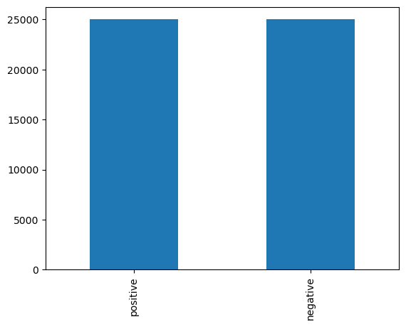
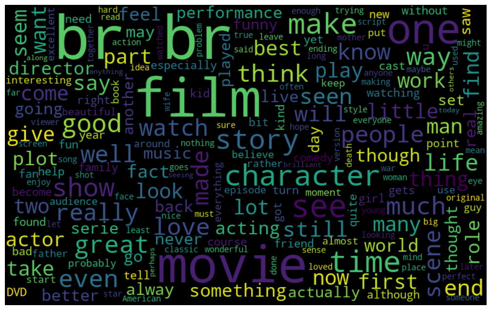
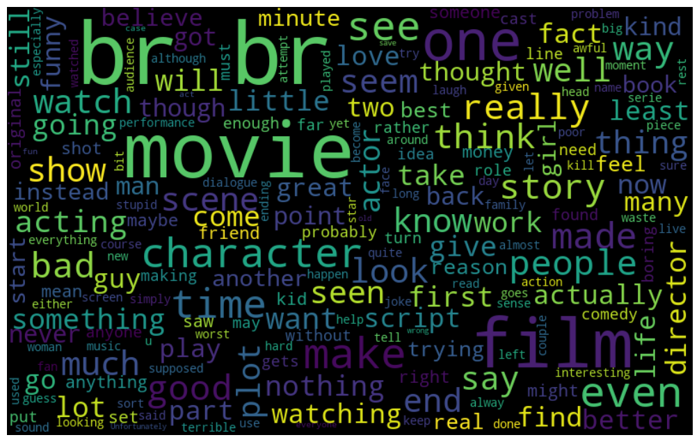

# NLP Challenge: IMDB Dataset of 50K Movie Reviews to perform Sentiment analysis

Do a thorough Exploratory Data Analysis of the dataset and report the final performance metrics for your approach. Suggest ways in which you can improve the model. Dataset: https://www.kaggle.com/datasets/lakshmi25npathi/imdb-dataset-of-50k-movie-reviews

## Data pre-processing

Pre-process the data via removing redundant words and stopwords and converting all words to lower-case.


```python
import csv
import os
import numpy as np
import pandas as pd
from sklearn.feature_extraction.text import TfidfVectorizer
import re
import nltk
from nltk.corpus import stopwords
from nltk.tokenize import word_tokenize
import gensim
from gensim.models import Word2Vec
from sklearn.model_selection import train_test_split
from sklearn.metrics import accuracy_score, confusion_matrix
from sklearn.ensemble import RandomForestClassifier 
from sklearn import metrics
import matplotlib.pyplot as plt
from wordcloud import WordCloud
```


```python
# Load stop words
nltk.download('stopwords')
nltk.download('punkt') #  a pre-trained model that provides support for tokenization
stop_words = set(stopwords.words('english'))

def preprocess(text):
    # Remove <br />
    text = re.sub(r'<br />', '', text, flags=re.MULTILINE)
    
    # Convert to lower case
    text = text.lower()
    
    # Remove stop words
    text_tokens = word_tokenize(text)
    tokens_without_sw = [token for token in text_tokens if not token in stop_words]
    filtered_text = ' '.join(tokens_without_sw)
    
    return filtered_text
```

    [nltk_data] Downloading package stopwords to C:\Users\MEI-KUEI
    [nltk_data]     LU\AppData\Roaming\nltk_data...
    [nltk_data]   Package stopwords is already up-to-date!
    [nltk_data] Downloading package punkt to C:\Users\MEI-KUEI
    [nltk_data]     LU\AppData\Roaming\nltk_data...
    [nltk_data]   Package punkt is already up-to-date!
    


```python
# read csv file 
data = []
data_path = 'IMDB_Dataset.csv'

with open(data_path, 'r', encoding='utf-8-sig') as f:
    csv_file = csv.reader(f)
    data = [row for row in csv_file]
```


```python
df = pd.DataFrame(data)
new_header = df.iloc[0] # grab the first row for the header
df = df[1:] # take the data less the header row
df.columns = new_header
df.head()
```


<div>
<table border="1" class="dataframe">
  <thead>
    <tr style="text-align: right;">
      <th></th>
      <th>review</th>
      <th>sentiment</th>
    </tr>
  </thead>
  <tbody>
    <tr>
      <th>1</th>
      <td>One of the other reviewers has mentioned that ...</td>
      <td>positive</td>
    </tr>
    <tr>
      <th>2</th>
      <td>A wonderful little production. &lt;br /&gt;&lt;br /&gt;The...</td>
      <td>positive</td>
    </tr>
    <tr>
      <th>3</th>
      <td>I thought this was a wonderful way to spend ti...</td>
      <td>positive</td>
    </tr>
    <tr>
      <th>4</th>
      <td>Basically there's a family where a little boy ...</td>
      <td>negative</td>
    </tr>
    <tr>
      <th>5</th>
      <td>Petter Mattei's "Love in the Time of Money" is...</td>
      <td>positive</td>
    </tr>
  </tbody>
</table>
</div>


```python
process_text = []

for i in range(50000):
    process_text.append(preprocess(df['review'].iloc[i]))
```


```python
# Add the new list as a new column to the DataFrame
df['Processed_review'] = process_text
df
```


<div>
<table border="1" class="dataframe">
  <thead>
    <tr style="text-align: right;">
      <th></th>
      <th>review</th>
      <th>sentiment</th>
      <th>Processed_review</th>
    </tr>
  </thead>
  <tbody>
    <tr>
      <th>1</th>
      <td>One of the other reviewers has mentioned that ...</td>
      <td>positive</td>
      <td>one reviewers mentioned watching 1 oz episode ...</td>
    </tr>
    <tr>
      <th>2</th>
      <td>A wonderful little production. &lt;br /&gt;&lt;br /&gt;The...</td>
      <td>positive</td>
      <td>wonderful little production . filming techniqu...</td>
    </tr>
    <tr>
      <th>3</th>
      <td>I thought this was a wonderful way to spend ti...</td>
      <td>positive</td>
      <td>thought wonderful way spend time hot summer we...</td>
    </tr>
    <tr>
      <th>4</th>
      <td>Basically there's a family where a little boy ...</td>
      <td>negative</td>
      <td>basically 's family little boy ( jake ) thinks...</td>
    </tr>
    <tr>
      <th>5</th>
      <td>Petter Mattei's "Love in the Time of Money" is...</td>
      <td>positive</td>
      <td>petter mattei 's `` love time money '' visuall...</td>
    </tr>
    <tr>
      <th>...</th>
      <td>...</td>
      <td>...</td>
      <td>...</td>
    </tr>
    <tr>
      <th>49996</th>
      <td>I thought this movie did a down right good job...</td>
      <td>positive</td>
      <td>thought movie right good job . n't creative or...</td>
    </tr>
    <tr>
      <th>49997</th>
      <td>Bad plot, bad dialogue, bad acting, idiotic di...</td>
      <td>negative</td>
      <td>bad plot , bad dialogue , bad acting , idiotic...</td>
    </tr>
    <tr>
      <th>49998</th>
      <td>I am a Catholic taught in parochial elementary...</td>
      <td>negative</td>
      <td>catholic taught parochial elementary schools n...</td>
    </tr>
    <tr>
      <th>49999</th>
      <td>I'm going to have to disagree with the previou...</td>
      <td>negative</td>
      <td>'m going disagree previous comment side maltin...</td>
    </tr>
    <tr>
      <th>50000</th>
      <td>No one expects the Star Trek movies to be high...</td>
      <td>negative</td>
      <td>one expects star trek movies high art , fans e...</td>
    </tr>
  </tbody>
</table>
<p>50000 rows × 3 columns</p>
</div>


## Exploratory Data Analysis


```python
positive = df[df['sentiment'] == 'positive']
negative = df[df['sentiment'] == 'negative']
```


```python
# Visualising the distribution of the target variable.
print(df.sentiment.value_counts())
df.sentiment.value_counts().plot(kind = 'bar')
plt.show()
```

    positive    25000
    negative    25000
    Name: sentiment, dtype: int64
    


    

    


```python
# frequent words visualization for positve reviews 

all_words = " ".join([sentence for sentence in df['review'][df['sentiment']=='positive']])

wordcloud = WordCloud(width=800, height=500, random_state=42, max_font_size=100).generate(all_words)

# plot the graph
plt.figure(figsize=(15,8))
plt.imshow(wordcloud, interpolation='bilinear')
plt.axis('off')
plt.show()
```


    

    


```python
# frequent words visualization for negative reviews 

all_words = " ".join([sentence for sentence in df['review'][df['sentiment']=='negative']])

wordcloud = WordCloud(width=800, height=500, random_state=42, max_font_size=100).generate(all_words)

# plot the graph
plt.figure(figsize=(15,8))
plt.imshow(wordcloud, interpolation='bilinear')
plt.axis('off')
plt.show()
```


    

    


## Feature extraction via bag-of-words representation

Extract the term frequency-inverse document frequency (TF-IDF) for every document. TF-IDF evaluates the relevance of a word is to a given document in a collection of documents. It is computed via multiplying the number of occurrences of a word in a document and the inverse document frequency of the word across a set of documents.

Top 25 words in the positive review 


```python
tfIdfVectorizer = TfidfVectorizer(use_idf=True)
tfIdf = tfIdfVectorizer.fit_transform(positive['Processed_review'])
tfidf = pd.DataFrame(tfIdf[0].T.todense(), index=tfIdfVectorizer.get_feature_names_out(), columns=["TF-IDF"])
tfidf = tfidf.sort_values('TF-IDF', ascending=False)
print (tfidf.head(25))
```

                   TF-IDF
    oz           0.442141
    violence     0.200113
    prison       0.182113
    inmates      0.171881
    forget       0.157192
    struck       0.138662
    scuffles     0.120146
    inwards      0.120146
    ll           0.117748
    gangstas     0.115477
    penitentary  0.115477
    agreements   0.107495
    bitches      0.104182
    word         0.103975
    aryans       0.102826
    show         0.102627
    latinos      0.101613
    nickel       0.101613
    emerald      0.100515
    due          0.100346
    privacy      0.096944
    episode      0.095888
    city         0.095033
    fronts       0.093631
    oswald       0.092021
    

Top 25 words in the negative review


```python
tfIdfVectorizer = TfidfVectorizer(use_idf=True)
tfIdf = tfIdfVectorizer.fit_transform(negative['Processed_review'])
tfidf = pd.DataFrame(tfIdf[0].T.todense(), index=tfIdfVectorizer.get_feature_names_out(), columns=["TF-IDF"])
tfidf = tfidf.sort_values('TF-IDF', ascending=False)
print (tfidf.head(25))
```

                   TF-IDF
    jake         0.551088
    parents      0.282771
    closet       0.256922
    drama        0.251797
    zombie       0.198509
    divorcing    0.185104
    thriller     0.179980
    boogeyman    0.156288
    slower       0.146177
    arguing      0.139187
    rambo        0.138467
    descent      0.130230
    spots        0.124985
    ruins        0.121736
    ignore       0.118066
    dialogs      0.117943
    meaningless  0.116519
    opera        0.106883
    soap         0.105931
    watchable    0.099302
    decides      0.097116
    thinks       0.096781
    fighting     0.095771
    decide       0.094551
    suddenly     0.093718
    

## Feature extraction via word2vec representation

Extract the word2vec representation for each document. Word2vec leverages a neural network and a large language corpus to output a vector representation of a document via learning word similarities and capturing the contextual meaning of the words. 


```python
# Train a Word2Vec model on your corpus of documents
model = Word2Vec(process_text, vector_size=300, window=5, min_count=5, workers=4)

# Obtain the Word2Vec representation for each document in your corpus
doc_vectors = []
for doc in process_text:
    words = doc.split()
    vectors = [model.wv.get_vector(word) for word in words if word in model.wv.key_to_index]
    if vectors:
        doc_vector = sum(vectors) / len(vectors)
    else:
        doc_vector = [0] * 300  # if no words in vocab, use zero vector
    doc_vectors.append(doc_vector)
```

## Review classification with Random Forest


```python
tfidf = tfIdfVectorizer.fit_transform(df['Processed_review'])
```


```python
# Add the new list as a new column to the DataFrame
df['word2vec'] = doc_vectors
df['TF-IDF'] = list(tfidf)
df
```


<div>
<table border="1" class="dataframe">
  <thead>
    <tr style="text-align: right;">
      <th></th>
      <th>review</th>
      <th>sentiment</th>
      <th>Processed_review</th>
      <th>word2vec</th>
    </tr>
  </thead>
  <tbody>
    <tr>
      <th>1</th>
      <td>One of the other reviewers has mentioned that ...</td>
      <td>positive</td>
      <td>one reviewers mentioned watching 1 oz episode ...</td>
      <td>[0.30815715, 0.19138381, -0.12065128, -0.01825...</td>
    </tr>
    <tr>
      <th>2</th>
      <td>A wonderful little production. &lt;br /&gt;&lt;br /&gt;The...</td>
      <td>positive</td>
      <td>wonderful little production . filming techniqu...</td>
      <td>[0.2523241, 0.17772922, -0.16176853, 0.1096976...</td>
    </tr>
    <tr>
      <th>3</th>
      <td>I thought this was a wonderful way to spend ti...</td>
      <td>positive</td>
      <td>thought wonderful way spend time hot summer we...</td>
      <td>[0.29740378, 0.12563016, -0.09930591, 0.082781...</td>
    </tr>
    <tr>
      <th>4</th>
      <td>Basically there's a family where a little boy ...</td>
      <td>negative</td>
      <td>basically 's family little boy ( jake ) thinks...</td>
      <td>[0.25177735, 0.31271428, -0.11365864, 0.180653...</td>
    </tr>
    <tr>
      <th>5</th>
      <td>Petter Mattei's "Love in the Time of Money" is...</td>
      <td>positive</td>
      <td>petter mattei 's `` love time money '' visuall...</td>
      <td>[0.30615774, 0.22650091, -0.14941713, -0.02184...</td>
    </tr>
    <tr>
      <th>...</th>
      <td>...</td>
      <td>...</td>
      <td>...</td>
      <td>...</td>
    </tr>
    <tr>
      <th>49996</th>
      <td>I thought this movie did a down right good job...</td>
      <td>positive</td>
      <td>thought movie right good job . n't creative or...</td>
      <td>[0.33465004, 0.1697293, -0.124990575, 0.020238...</td>
    </tr>
    <tr>
      <th>49997</th>
      <td>Bad plot, bad dialogue, bad acting, idiotic di...</td>
      <td>negative</td>
      <td>bad plot , bad dialogue , bad acting , idiotic...</td>
      <td>[0.3365669, 0.18850604, -0.1503556, 0.00865876...</td>
    </tr>
    <tr>
      <th>49998</th>
      <td>I am a Catholic taught in parochial elementary...</td>
      <td>negative</td>
      <td>catholic taught parochial elementary schools n...</td>
      <td>[0.29525027, 0.23899497, -0.07822679, 0.015214...</td>
    </tr>
    <tr>
      <th>49999</th>
      <td>I'm going to have to disagree with the previou...</td>
      <td>negative</td>
      <td>'m going disagree previous comment side maltin...</td>
      <td>[0.31426436, 0.16596323, -0.0894153, 0.0184372...</td>
    </tr>
    <tr>
      <th>50000</th>
      <td>No one expects the Star Trek movies to be high...</td>
      <td>negative</td>
      <td>one expects star trek movies high art , fans e...</td>
      <td>[-0.0508082, 0.19942117, 0.21960713, 0.0370069...</td>
    </tr>
  </tbody>
</table>
<p>50000 rows × 4 columns</p>
</div>


Train with TF-IDF feature


```python
# transform the classes from text to numbers as labels 
# 0: negative, 1: positive
y = df[["sentiment"]] 

sentiment2number_dict = {
    'negative':0,
    'positive':1
}

y = y.replace({"sentiment": sentiment2number_dict})
```


```python
# split the data into training and testing set using 70%/30% split. 
x_train, x_test, y_train, y_test = train_test_split(tfidf, y, test_size=0.33, random_state=42)

print(x_train.shape)
print(x_test.shape)
print(y_train.shape)
print(y_test.shape)
```

    (33500, 104072)
    (16500, 104072)
    (33500, 1)
    (16500, 1)
    


```python
model = RandomForestClassifier(n_estimators=1000)
model.fit(x_train, y_train)
ypred = model.predict(x_test)
```

    C:\Users\MEI-KUEI LU\AppData\Local\Temp\ipykernel_10176\2448598726.py:2: DataConversionWarning: A column-vector y was passed when a 1d array was expected. Please change the shape of y to (n_samples,), for example using ravel().
      model.fit(x_train, y_train)
    


```python
# Classification Report 
print(metrics.classification_report(y_test, ypred))

# Confusion matrix of RFC
confused = confusion_matrix(y_test,ypred)
print(confused)
```

                  precision    recall  f1-score   support
    
               0       0.87      0.86      0.87      8208
               1       0.87      0.88      0.87      8292
    
        accuracy                           0.87     16500
       macro avg       0.87      0.87      0.87     16500
    weighted avg       0.87      0.87      0.87     16500
    
    [[7083 1125]
     [1033 7259]]
    

Train with word2vec feature


```python
# split the data into training and testing set using 70%/30% split. 

x_train, x_test, y_train, y_test = train_test_split(doc_vectors, y, test_size=0.33, random_state=42)

print(np.array(x_train).shape)
print(np.array(x_test).shape)
print(np.array(y_train).shape)
print(np.array(y_test).shape)
```

    (33500, 300)
    (16500, 300)
    (33500, 1)
    (16500, 1)
    


```python
model = RandomForestClassifier(n_estimators=1000)
model.fit(x_train, y_train)
ypred = model.predict(x_test) 
```

    C:\Users\MEI-KUEI LU\AppData\Local\Temp\ipykernel_10176\2448598726.py:2: DataConversionWarning: A column-vector y was passed when a 1d array was expected. Please change the shape of y to (n_samples,), for example using ravel().
      model.fit(x_train, y_train)
    


```python
# Classification Report 
print(metrics.classification_report(y_test, ypred))

# Confusion matrix of RFC
confused = confusion_matrix(y_test,ypred)
print(confused) 
```

                  precision    recall  f1-score   support
    
               0       0.59      0.55      0.57      8208
               1       0.58      0.63      0.60      8292
    
        accuracy                           0.59     16500
       macro avg       0.59      0.59      0.59     16500
    weighted avg       0.59      0.59      0.59     16500
    
    [[4510 3698]
     [3107 5185]]
    

<h3> Conclusions </h3> 

The accuracy of the TF-IDF feature and word2vec feature for random forest model are 0.87 and 0.59 respectively. TF-IDF feature performs much better than word2vec feature. Hyperparameter tuning, feature selection, cross-validation and regularization can be implemented to prevent overfitting and improve the generalization performance of the model. Other supervised machine learning models such as SVM or Logisitic Regression could also be tested to investigate the performances of these models, which might improve the model performance.
